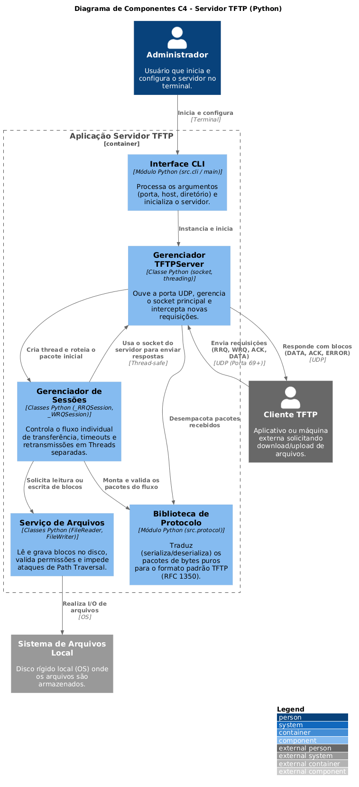
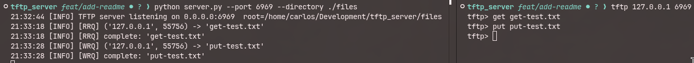
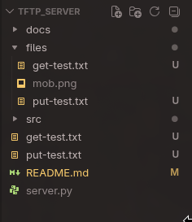

# TFTP Server

Servidor TFTP implementado em Python.

## Como usar

```bash
python server.py --host 0.0.0.0 --port 69 --directory ./files
```

### Argumentos

| Argumento     | Padrão    | Descrição                          |
| ------------- | --------- | ---------------------------------- |
| `--host`      | `0.0.0.0` | Endereço para bind do servidor     |
| `--port`      | `69`      | Porta UDP para escutar             |
| `--directory` | `.`       | Diretório raiz para transferências |

## Estrutura

```
tftp-server/
├── server.py
├── README.md
├── docs/
│   ├── diagrams/
│   └── prints/
└── src/
    ├── __init__.py
    └── cli.py
```

---

## Arquitetura (C4 Model)

Diagrama de componentes detalhando o funcionamento interno do servidor:



---

## Teste

Para testar o servidor localmente, iniciamos o serviço em uma porta alternativa (6969) e definimos o diretório `./files` como raiz:

```bash
python server.py --port 6969 --directory ./files
```

Em seguida, em outro terminal, utilizamos um cliente TFTP para conectar ao servidor local, baixar um arquivo (get) e enviar outro (put):

```bash
tftp 127.0.0.1 6969
```

```bash
tftp> get get-test.txt
tftp> put put-test.txt
```

Abaixo, o log de execução mostrando o servidor processando as requisições de leitura (RRQ) e escrita (WRQ) perfeitamente:



A imagem a seguir mostra a estrutura de arquivos após os testes, confirmando que o arquivo de envio foi salvo no diretório ./files e o arquivo baixado foi salvo na raiz do cliente:


